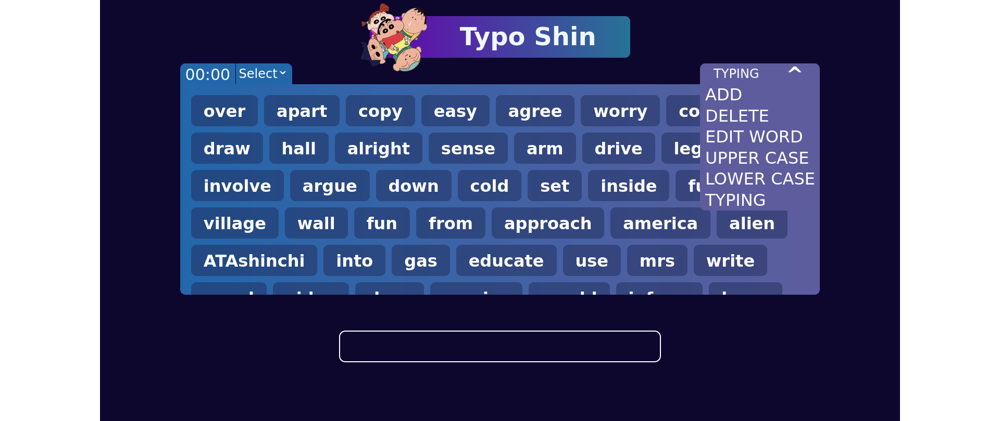

## Typing Speed Test

A fun, interactive typing speed test application to gauge your words-per-minute (WPM) and accuracy. Perfect for those looking to improve their typing skills or challenge friends!

### Features:

1. **Timed Tests:** Choose from 1, 2, or 5 minute tests.
2. **Dynamic Feedback:** Words change color based on user input accuracy.
3. **WPM and Accuracy Metrics:** Displays words-per-minute (WPM) and accuracy percentage after each test.
4. **Custom Word Lists:** Users can add, delete, edit, or change the case of words.
5. **Cool Graphics:** Entertaining gifs to make the experience enjoyable.

### How to Use:

1. **Select Test Duration:** Choose your desired typing test length from the dropdown.
2. **Start Typing:** Type the words displayed on the screen. The test will start as soon as you begin typing.
3. **View Results:** After the time is up, your WPM and accuracy will be displayed.
4. **Customize Word Lists:** Use the 'More' dropdown to add, delete, edit, or change the case of words.

### Technology Stack:

- **JavaScript**: For interactivity, DOM manipulations, and logic.
- **CSS**: Styling and animations.

### How to Run Locally:

1. Clone this repository.
2. Navigate to the project directory.
3. Open `index.html` in your browser.

### Contributions:

Contributions are welcome!
